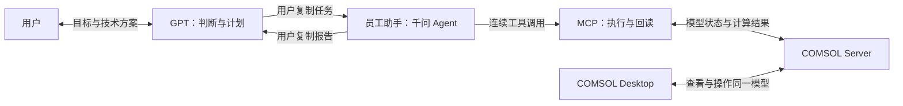

# COMSOL 协作架构

## 工作方式

GPT 与用户确定技术方案，员工助手中的千问 Agent 组织执行，MCP 完成明确操作，COMSOL 维护模型并计算。用户在 GPT 与员工助手之间转交完整任务和报告。

GPT 查阅项目工具定义和对应版本的 COMSOL 文档，给出对象查找条件、具体调用、顺序、条件分支和验证判据。员工助手处理连接、定位、分页和步骤衔接；需要新的技术选择时，将事实和具体问题返回 GPT。

## 运行代码的分工

| 模块 | 职责 |
| --- | --- |
| `src/server.py` | 注册工具，启动 stdio MCP 服务 |
| `src/tools/` | 定义调用参数，组织本次具体操作及其返回事实 |
| `core/session.py` | 连接生命周期、模型登记和当前模型标记 |
| `core/tool_runtime.py` | 串行执行入口、模型存活检查、异常报告和调用记录 |
| `core/execution.py` | 共享锁及本次调用已定位的模型 |
| `core/model_api.py` | 对象访问链、类型参数、API 调用和回读比较 |
| `core/diagnostics.py` | 模型概况和指定范围的信息采集 |
| `core/solver.py` | 后台求解、运行标识、状态和等待 |
| `core/reports.py` | 公共报告结构、事实序列化、排版和分页 |
| `core/runtime_info.py` | 报告中的部署版本与源码信息 |
| `src/doctor.py` | 安装环境诊断命令 |

一次模型操作在公共入口取得锁、确认模型存活，再让具体工具使用本次已经定位的对象。通用写入在同一次操作中完成前置条件、取证、写入和验证。模型登记的变更集中在连接管理器中。

求解由后台线程接续持有共享锁。状态查询和报告续页可在计算期间使用。COMSOL Desktop 是另一个客户端，本地锁覆盖本 MCP 进程中的操作。

## 报告与数据

各类报告共用版本、操作名称、对象、请求、状态、摘要、错误和时间字段；实际读取、修改前后值及验证结果作为该类操作的事实保留。字段与交接方式见 [任务与报告约定](task-protocol.md)。

长报告按原始快照分页，保留最近使用的 16 份，MCP 进程退出后失效。调用记录写入 `COMSOL_MCP_DATA_DIR/audit/`。模型保存和结果导出使用任务指定的绝对路径。

## 员工助手接入

当前执行端选用员工助手，使用公司千问模型。仓库提供 stdio MCP 服务、执行规则和 Skill；员工助手负责运行 Agent 并连续调用工具。启动配置见 [README](../README_CN.md#接入员工助手)。本机进程启动及 MCP 接入能力在公司环境验收。

协作文档按读者和用途组织：

- [GPT instructions](gpt-project-instructions.md)：GPT 的分析、规划和结果判断。
- [AGENTS.md](../AGENTS.md)：员工助手的公共执行规则。
- [.agents/skills/](../.agents/skills/)：信息采集与计划执行的工具使用方法。
- [任务与报告约定](task-protocol.md)：整段复制的消息格式、示例和报告续页。
- [维护与发布说明](../RELEASE_CONTENTS.md)：程序测试、真实验收和发布入口。

## 后续计算接续

当前后台求解属于运行中的 MCP 进程。取消接口报告当前连接不支持按运行标识取消，实际停止可在 Desktop 中操作，再查询运行状态。

未来如需夜间排队、断线后恢复和手机查询，再增加持久任务状态和排队机制，并对接员工助手的实际入口。当前先用公司电脑验证日常流程：任务接收、定位、操作、回读，以及把结果交回 GPT。
